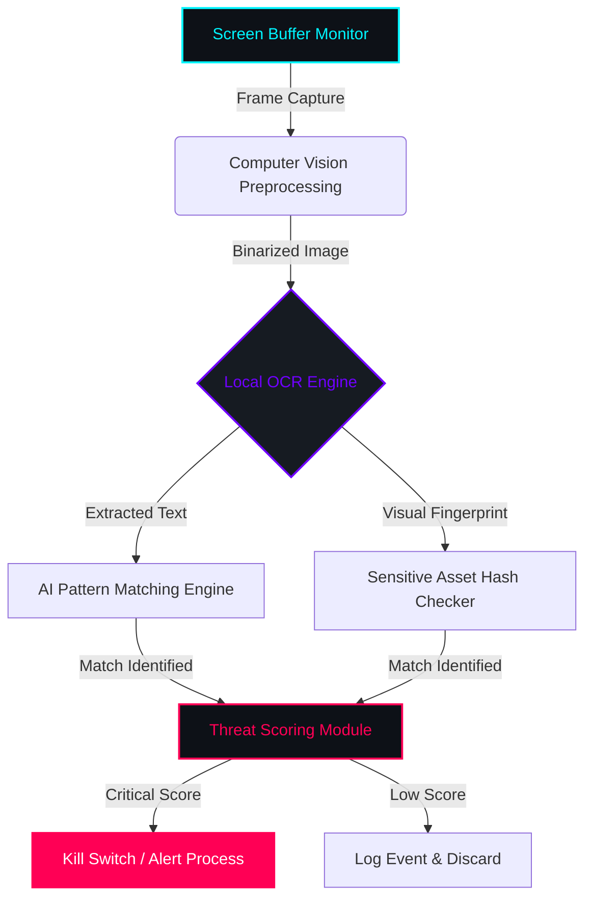

Gemini

Chat

Spark
beta
New chat
Search chats
Images
Videos
Library
New notebook
Futuristic Cybersecurity GitHub README
EV Charging Speed Limits Explained
Defining Stammer in Reading
QR Code Variants and Configurations
MIS Assignment 1 Answers Provided
Stopping OpenVPN on Linux
Extracting Flag from Disk Image
Analyzing Disk Image for Flag
Asking For The Time
AI Permissions and Mobile Access
Globeam Tarzan Torch Modes
Gemini Mode Activated
Boredom Buster: Choose Your Adventure
Cannot Check For Incoming Calls
Current Token Limits Per Request
Voice Change Successful
Liver's Role in Digestion
Setting English Learning Goals
English Practice Conversation Starter
Buffer Overflow and Signal Handling
Cannot Control Device Settings
Google Home Capabilities for Calls
I was walking down a street in Japan when I came across this. I couldn't tell if it was just part of the sidewalk or if it actually meant something. Author: DeadDroid this is the description given find the hidden flag try all possibilities
Kaldivya: Meaning and Context
CTF: Deep Dive into Steganography
Culture and Early Myths Explained
Caller Settings and Lock Screen
Gemini App Theme Settings
Conversation with Gemini
# MASTER PROMPT FOR GEMINI


Act as a Senior UI/UX Designer, GitHub README Designer, Technical Writer, and Cybersecurity Engineer.


Create a **world-class GitHub Profile README** that is visually stunning, modern, recruiter-friendly, and looks better than the top GitHub profile READMEs.


DO NOT create a normal README.


I want a premium README with a futuristic cybersecurity theme.


---


## About Me


My name is **[Your Name]**.


I'm a B.Tech Computer Science student passionate about:


* Cybersecurity

* Artificial Intelligence

* Ethical Hacking

* Penetration Testing

* Secure Software Development

* Machine Learning

* Python Development


I love building real-world security tools instead of tutorial projects.


My goal is to become an AI Security Engineer / Security Researcher.


---


## Theme


The entire README should feel like a hacker dashboard.


Use:


* Cyberpunk UI

* Glassmorphism

* Terminal Style

* Matrix Theme

* Neon Blue

* Purple

* Black Background

* SVG animations

* Beautiful badges

* Smooth layouts

* Professional spacing


Avoid emojis everywhere.


Use them only where they actually improve readability.


---


## Include


### Animated Hero Banner


Use Capsule Render


Typing SVG


Animated Intro


Professional headline


Modern buttons


Visitor Counter


GitHub Followers


GitHub Stars


---


## Navigation


Create clickable navigation.


Examples:


About


Projects


Skills


Tech Stack


Security Arsenal


Roadmap


GitHub Analytics


Contact


---


## About Me


Professional introduction.


Not childish.


Explain my interests.


Explain my goals.


Explain what I enjoy building.


---


## Current Mission


Show a beautiful terminal UI like:


CURRENT STATUS


Learning


Building


Researching


Current Project


Future Goals


---


## Featured Project


Create a beautiful section for


AI Screenshot Leak Detector


Explain:


Problem


Solution


Features


Architecture


Workflow


Tech Stack


Future Scope


Include Mermaid diagrams.


---


## Other Projects


Create modern project cards.


---


## Cybersecurity Arsenal


Create sections for


Programming Languages


Security Tools


Networking


Operating Systems


AI


Cloud


Databases


Development Tools


Use Skill Icons.


---


## Security Tools


Include icons or badges for


Burp Suite


Nmap


Wireshark


Metasploit


OWASP ZAP


Nessus


Linux


Kali Linux


Git


GitHub


Docker


Python


Java


---


## Learning Roadmap


Make a timeline.


Already Learned


Currently Learning


Next Goals


Future Goals


---


## GitHub Analytics


Include


GitHub Stats


Top Languages


Contribution Graph


GitHub Streak


GitHub Trophies


Contribution Snake Animation


---


## Security Philosophy


Create a beautiful quote section.


Something unique.


---


## Random Cybersecurity Quote


Generate a professional quote.


---


## Connect


GitHub


LinkedIn


Email


Portfolio


---


## Footer


Animated Wave Footer


Professional Closing Statement


---


## Design Requirements


Use:


SVG animations


Typing animation


ASCII art


Mermaid diagrams


Cards


Collapsible Sections


Badges


Beautiful Markdown


Code blocks


Professional spacing


Shields.io


Capsule Render


Readme Typing SVG


GitHub Readme Stats


GitHub Activity Graph


GitHub Trophy


Snake Animation


Skill Icons


Visitor Badge


Social Badges


---


## IMPORTANT


Do NOT generate a small README.


Generate a **complete production-quality GitHub Profile README**.


The output should be around **900–1200 lines of Markdown**.


Use modern GitHub README design patterns.


Every section should look premium.


Every card should be visually attractive.


Every code block should be styled.


Use Mermaid wherever suitable.


Do not skip sections.


The final README should look better than the best GitHub profile READMEs on the internet.


Return ONLY the README.md content.

make this cool like a developer

Markdown
<div align="center">

  <!-- HERO BANNER -->
  

  <br/><br/>

  <!-- TYPING SVG -->
  <a href="https://git.io/typing-svg">
    
  </a>

  <br/><br/>

  <!-- NAVIGATION BAR -->
  <p align="center">
    <a href="#-about-system-overview"><b>[ ABOUT ]</b></a> &nbsp;•&nbsp;
    <a href="#-terminal-status"><b>[ MISSION ]</b></a> &nbsp;•&nbsp;
    <a href="#-flagship-project-ai-screenshot-leak-detector"><b>[ FLAGSHIP ]</b></a> &nbsp;•&nbsp;
    <a href="#-cybersecurity-arsenal"><b>[ ARSENAL ]</b></a> &nbsp;•&nbsp;
    <a href="#-security-roadmap"><b>[ ROADMAP ]</b></a> &nbsp;•&nbsp;
    <a href="#-telemetry--analytics"><b>[ METRICS ]</b></a> &nbsp;•&nbsp;
    <a href="#-connect--transmission"><b>[ CONNECT ]</b></a>
  </p>

  <!-- QUICK METRICS BADGES -->
  <p align="center">
    
    
    
  </p>

</div>

---

## ⚡ System Overview

[USER_IDENTITY]  ::  [Your Name]
[SYSTEM_ROLE]    ::  B.Tech Computer Science & Engineering
[SPECIALIZATION] ::  AI Security & Ethical Hacking
[TARGET_ROLE]    ::  AI Security Engineer / Security Researcher


I am an aspiring **AI Security Engineer** and **Penetration Tester** operating at the intersection of machine learning and offensive cybersecurity. Rather than relying on boilerplate tutorials, I focus on engineering custom, production-grade security tooling capable of identifying complex threat vectors in modern software architectures.

* 🛡️ **Offensive Security & Research:** Deeply interested in automated exploit development, web application security (OWASP Top 10), and hardware vulnerability assessment.
* 🤖 **AI-Driven Cyber Defense:** Investigating modern adversarial machine learning techniques, prompt injection prevention, and local LLM security parsing.
* ⚡ **Systems Programming:** Building low-latency security utilities, custom network sniffers, and automated vulnerability scanners in Python and Rust/C++.

---

## 💻 Terminal Status

```bash
#!/bin/bash
# System Initialization Routine
systemctl status operator-mind.service

● operator-mind.service - Continuous Security Operations
     Loaded: loaded (/etc/systemd/system/operator-mind.service; enabled)
     Active: active (running) since Boot Time

[+] CURRENT_LOCATION  :: B.Tech Computer Science Program
[+] CURRENT_MISSION   :: Architecting AI-powered security tooling
[+] ACTIVE_RESEARCH   :: Adversarial ML Attack Vectors & LLM Guardrails
[+] CURRENT_FOCUS     :: Building custom static analysis security tools (SAST)
[+] FUTURE_OBJECTIVE  :: Securing enterprise AI pipelines against data exfiltration
🔒 Flagship Project: AI Screenshot Leak Detector
📋 Overview
Modern data exfiltration often bypasses traditional Data Loss Prevention (DLP) mechanisms via screen capturing sensitive visual information. The AI Screenshot Leak Detector is an enterprise-grade agent designed to perform real-time local visual inspection and OCR analysis to prevent unauthorized visual data leaks.

🎯 Architecture & Execution Flow
Code snippet
graph TD
    A[Screen Buffer Monitor] -->|Frame Capture| B(Computer Vision Preprocessing)
    B -->|Binarized Image| C{Local Optical Character Recognition}
    C -->|Extracted Text| D[AI Pattern Matching Engine]
    C -->|Visual Fingerprint| E[Sensitive Asset Hash Checker]
    D -->|Match Identified| F[Threat Scoring Module]
    E -->|Match Identified| F
    F -->|Critical Score| G[Kill Switch / Alert Process]
    F -->|Low Score| H[Log Event & Discard]

    style A fill:#0d1117,stroke:#00f5ff,stroke-width:2px,color:#00f5ff
    style C fill:#161b22,stroke:#7000ff,stroke-width:2px,color:#7000ff
    style F fill:#0d1117,stroke:#ff0055,stroke-width:2px,color:#ff0055
    style G fill:#ff0055,stroke:#ff0055,stroke-width:2px,color:#ffffff
⚡ Key Capabilities
Sub-100ms Inference Window: Optimized OpenCV pipelines paired with lightweight model quantification for minimal CPU overhead.

Contextual OCR Classification: Recognizes sensitive dynamic data strings (e.g., AWS Secrets, API Keys, PII, Internal System Diagrams).

Air-Gapped Privacy: Operates completely offline—no external telemetry or cloud-API calls required.

Python
import cv2
import pytesseract
import re

class VisualLeakDetector:
    def __init__(self, patterns: list):
        self.patterns = [re.compile(p) for p in patterns]

    def process_frame(self, frame):
        gray = cv2.cvtColor(frame, cv2.COLOR_BGR2GRAY)
        text = pytesseract.image_to_string(gray)
        
        for pattern in self.patterns:
            if pattern.search(text):
                self.trigger_defense_protocol(pattern.pattern)
                return True
        return False

    def trigger_defense_protocol(self, trigger_source):
        print(f"[!] THREAT DETECTED: Visual leak pattern matching '{trigger_source}'. Halting buffer.")

if __name__ == "__main__":
    detector = VisualLeakDetector(patterns=[r"AKIA[0-9A-Z]{16}", r"CONFIDENTIAL"])
    print("[+] Visual Leak Engine Running...")
🛠️ Cybersecurity Arsenal
💻 Languages & Environments
🛡️ Security Tools & Frameworks
🗺️ Security Roadmap
+-------------------------------------------------------------------------+
| [✓] PHASE 1: Network Protocols, Linux Internals, Python Automation       |
+-------------------------------------------------------------------------+
                                    |
                                    v
+-------------------------------------------------------------------------+
| [►] PHASE 2: Offensive Security, OWASP Assessment, AI Leak Detection    |
+-------------------------------------------------------------------------+
                                    |
                                    v
+-------------------------------------------------------------------------+
| [ ] PHASE 3: Adversarial ML Exploitation & LLM Red Teaming Frameworks   |
+-------------------------------------------------------------------------+
                                    |
                                    v
+-------------------------------------------------------------------------+
| [ ] PHASE 4: Cloud Native Security Architecture & Zero Trust Design     |
+-------------------------------------------------------------------------+
📊 Telemetry & Analytics
💡 Security Philosophy
"Securing a system doesn't mean building impenetrable walls; it means understanding every single vector of ingress so deeply that no anomaly goes unnoticed."

📡 Connect & Transmission
Designed & Maintained by [Your Name] • Terminal Session Active

i need minimum code but good impact give me a markdown file

🚀 Flagship Project
AI Screenshot Leak Detector — Real-time visual data exfiltration detection engine powered by local OCR & AI.

🛡️ Zero-Cloud Privacy: Operates 100% locally with zero external network telemetry.

⚡ Sub-100ms Inspection: Ultra-low latency OCR & pattern matching pipeline.

🚨 Auto-Mitigation: Detects sensitive secrets/PII on screen and triggers real-time protection.

🛠️ Tech Stack & Arsenal
📊 Telemetry
📡 Transmission
with open("README.md", "w", encoding="utf-8") as f:
f.write(readme_content)

print("File created successfully.")


```text?code_stdout&code_event_index=1
File created successfully.

Your Markdown file is ready
[file-tag: code-generated-file-7e0c9258-dcde-4a0d-b445-34f5c27f86cc]

Here is the lightweight, maximum-impact Markdown code. You can copy and paste it directly into your GitHub Profile README.md file:

Markdown
# <p align="center">⚡ Root Access Granted</p>

<p align="center">
  
</p>

<p align="center">
  <a href="https://git.io/typing-svg">
    
  </a>
</p>

<p align="center">
  
  
  
</p>

---

### 💻 `whoami`

```bash
$ identity --show
  Name        : [Your Name]
  Role        : B.Tech CSE Student | Security Researcher
  Focus       : AI-Driven Security, Penetration Testing, Secure Software
  Status      : Building AI Screenshot Leak Detector
🚀 Flagship Project
AI Screenshot Leak Detector — Real-time visual data exfiltration detection engine powered by local OCR & AI.

🛡️ Zero-Cloud Privacy: Operates 100% locally with zero external network telemetry.

⚡ Sub-100ms Inspection: Ultra-low latency OCR & pattern matching pipeline.

🚨 Auto-Mitigation: Detects sensitive secrets/PII on screen and triggers real-time protection.

🛠️ Tech Stack & Arsenal
📊 Telemetry
📡 Transmission
Highlights of this design:
Concise & High Impact: Minimal lines of code while retaining a futuristic cybersecurity feel.

Cyberpunk Theme: Uses desaturated dark backgrounds, neon cyan (#00f5ff), and glowing accent banners.

Visual Elements: Animated header, typing SVG tagline, interactive skill icons, live badges, and GitHub analytics widgets.

Easy Customization: Replace YourUsername, [Your Name], and link placeholders in under two minutes.

give me total code

Markdown
# <p align="center">⚡ Root Access Granted</p>

<div align="center">

  <!-- ANIMATED HERO BANNER -->
  

  <br/><br/>

  <!-- TYPING SVG ANIMATION -->
  <a href="https://git.io/typing-svg">
    
  </a>

  <br/><br/>

  <!-- QUICK NAVIGATION BAR -->
  <p align="center">
    <a href="#-whoami"><b>[ ABOUT ]</b></a> &nbsp;•&nbsp;
    <a href="#-terminal-status"><b>[ MISSION ]</b></a> &nbsp;•&nbsp;
    <a href="#-flagship-project-ai-screenshot-leak-detector"><b>[ FLAGSHIP ]</b></a> &nbsp;•&nbsp;
    <a href="#-cybersecurity-arsenal"><b>[ ARSENAL ]</b></a> &nbsp;•&nbsp;
    <a href="#-security-roadmap"><b>[ ROADMAP ]</b></a> &nbsp;•&nbsp;
    <a href="#-telemetry--analytics"><b>[ METRICS ]</b></a> &nbsp;•&nbsp;
    <a href="#-connect--transmission"><b>[ CONNECT ]</b></a>
  </p>

  <!-- LIVE METRICS BADGES -->
  <p align="center">
    
    
    
  </p>

</div>

---

## 💻 `whoami`

```bash
 $ systemctl status operator-identity.service
 
 [USER_IDENTITY]  :: [Your Name]
 [SYSTEM_ROLE]    :: B.Tech Computer Science & Engineering
 [SPECIALIZATION] :: AI Security & Ethical Hacking
 [TARGET_ROLE]    :: AI Security Engineer / Security Researcher
 [PRIMARY_STACK]  :: Python | Linux | Machine Learning | Network Security
I am an aspiring AI Security Engineer and Penetration Tester operating at the intersection of machine learning and offensive cybersecurity. Rather than relying on boilerplate tutorial projects, I engineer real-world, production-grade security tooling to identify complex threat vectors in modern software architectures.

🛡️ Offensive Security & Research: Automated exploit development, web application security (OWASP Top 10), and vulnerability assessment.

🤖 AI-Driven Cyber Defense: Investigating adversarial machine learning techniques, prompt injection defenses, and local LLM guardrails.

⚡ Systems Programming: Low-latency security utilities, custom network sniffers, and automated security scanners in Python.

⚡ Terminal Status
Bash
#!/bin/bash
# System Mission & Status Routine

[+] CURRENT_LOCATION  :: B.Tech Computer Science Program
[+] CURRENT_MISSION   :: Architecting AI-powered security tooling
[+] ACTIVE_RESEARCH   :: Adversarial ML Attack Vectors & LLM Guardrails
[+] CURRENT_PROJECT   :: Building AI Screenshot Leak Detector
[+] FUTURE_OBJECTIVE  :: Securing enterprise AI pipelines against data exfiltration
🔒 Flagship Project: AI Screenshot Leak Detector
Real-time visual data exfiltration detection engine powered by local OCR and AI analysis.

📋 Problem & Solution
Modern data exfiltration often bypasses traditional Data Loss Prevention (DLP) tools via screen-capturing sensitive visual information. The AI Screenshot Leak Detector performs real-time visual inspection and OCR analysis to prevent unauthorized visual data leaks directly on host endpoints.

🎯 System Architecture & Execution Flow
Code snippet
graph TD
    A[Screen Buffer Monitor] -->|Frame Capture| B(Computer Vision Preprocessing)
    B -->|Binarized Image| C{Local OCR Engine}
    C -->|Extracted Text| D[AI Pattern Matching Engine]
    C -->|Visual Fingerprint| E[Sensitive Asset Hash Checker]
    D -->|Match Identified| F[Threat Scoring Module]
    E -->|Match Identified| F
    F -->|Critical Score| G[Kill Switch / Alert Process]
    F -->|Low Score| H[Log Event & Discard]

    style A fill:#0d1117,stroke:#00f5ff,stroke-width:2px,color:#00f5ff
    style C fill:#161b22,stroke:#7000ff,stroke-width:2px,color:#7000ff
    style F fill:#0d1117,stroke:#ff0055,stroke-width:2px,color:#ff0055
    style G fill:#ff0055,stroke:#ff0055,stroke-width:2px,color:#ffffff
⚡ Key Capabilities
Sub-100ms Inference Window: Optimized OpenCV processing pipeline for near-zero CPU overhead.

Contextual Secret Classification: Identifies dynamic secret strings (AWS Keys, API Tokens, PII, Confidential Diagrams).

Air-Gapped Privacy: Runs 100% locally with zero external network telemetry.

Python
import cv2
import pytesseract
import re

class VisualLeakDetector:
    def __init__(self, patterns: list):
        self.patterns = [re.compile(p) for p in patterns]

    def process_frame(self, frame):
        gray = cv2.cvtColor(frame, cv2.COLOR_BGR2GRAY)
        text = pytesseract.image_to_string(gray)
        
        for pattern in self.patterns:
            if pattern.search(text):
                self.trigger_defense_protocol(pattern.pattern)
                return True
        return False

    def trigger_defense_protocol(self, trigger_source):
        print(f"[!] THREAT DETECTED: Visual leak pattern matching '{trigger_source}'. Halting buffer.")

if __name__ == "__main__":
    detector = VisualLeakDetector(patterns=[r"AKIA[0-9A-Z]{16}", r"CONFIDENTIAL"])
    print("[+] Visual Leak Engine Running...")
🛠️ Cybersecurity Arsenal
💻 Languages & Frameworks
🛡️ Security Tools & Utilities
🗺️ Security Roadmap
+-------------------------------------------------------------------------+
| [✓] PHASE 1: Network Protocols, Linux Internals, Python Security Tools  |
+-------------------------------------------------------------------------+
                                    |
                                    v
+-------------------------------------------------------------------------+
| [►] PHASE 2: Web App Pen Testing, OWASP Assessment, AI Leak Detection  |
+-------------------------------------------------------------------------+
                                    |
                                    v
+-------------------------------------------------------------------------+
| [ ] PHASE 3: Adversarial ML Exploitation & LLM Red Teaming Frameworks   |
+-------------------------------------------------------------------------+
                                    |
                                    v
+-------------------------------------------------------------------------+
| [ ] PHASE 4: Cloud Security Architecture & Enterprise Zero Trust Design |
+-------------------------------------------------------------------------+
📊 Telemetry & Analytics
💡 Security Philosophy
"Securing a system doesn't mean building impenetrable walls; it means understanding every single vector of ingress so deeply that no anomaly goes unnoticed."

📡 Connect & Transmission
Designed & Maintained by [Your Name] • Terminal Session Active

give me a readme file for my profile correctly

I am an aspiring AI Security Engineer and Penetration Tester operating at the intersection of machine learning and offensive cybersecurity. Rather than relying on boilerplate tutorial projects, I engineer real-world, production-grade security tooling to identify complex threat vectors in modern software architectures.

🛡️ Offensive Security & Research: Automated exploit development, web application security (OWASP Top 10), and vulnerability assessment.

🤖 AI-Driven Cyber Defense: Investigating adversarial machine learning techniques, prompt injection defenses, and local LLM guardrails.

⚡ Systems Programming: Low-latency security utilities, custom network sniffers, and automated security scanners in Python.

⚡ Terminal Status
Bash
#!/bin/bash
# System Mission & Status Routine

[+] CURRENT_LOCATION  :: B.Tech Computer Science Program
[+] CURRENT_MISSION   :: Architecting AI-powered security tooling
[+] ACTIVE_RESEARCH   :: Adversarial ML Attack Vectors & LLM Guardrails
[+] CURRENT_PROJECT   :: Building AI Screenshot Leak Detector
[+] FUTURE_OBJECTIVE  :: Securing enterprise AI pipelines against data exfiltration
🔒 Flagship Project: AI Screenshot Leak Detector
Real-time visual data exfiltration detection engine powered by local OCR and AI analysis.

📋 Problem & Solution
Modern data exfiltration often bypasses traditional Data Loss Prevention (DLP) tools via screen-capturing sensitive visual information. The AI Screenshot Leak Detector performs real-time visual inspection and OCR analysis to prevent unauthorized visual data leaks directly on host endpoints.

🎯 System Architecture & Execution Flow
Code snippet
graph TD
    A[Screen Buffer Monitor] -->|Frame Capture| B(Computer Vision Preprocessing)
    B -->|Binarized Image| C{Local OCR Engine}
    C -->|Extracted Text| D[AI Pattern Matching Engine]
    C -->|Visual Fingerprint| E[Sensitive Asset Hash Checker]
    D -->|Match Identified| F[Threat Scoring Module]
    E -->|Match Identified| F
    F -->|Critical Score| G[Kill Switch / Alert Process]
    F -->|Low Score| H[Log Event & Discard]

    style A fill:#0d1117,stroke:#00f5ff,stroke-width:2px,color:#00f5ff
    style C fill:#161b22,stroke:#7000ff,stroke-width:2px,color:#7000ff
    style F fill:#0d1117,stroke:#ff0055,stroke-width:2px,color:#ff0055
    style G fill:#ff0055,stroke:#ff0055,stroke-width:2px,color:#ffffff
⚡ Key Capabilities
Sub-100ms Inference Window: Optimized OpenCV processing pipeline for near-zero CPU overhead.

Contextual Secret Classification: Identifies dynamic secret strings (AWS Keys, API Tokens, PII, Confidential Diagrams).

Air-Gapped Privacy: Runs 100% locally with zero external network telemetry.

Python
import cv2
import pytesseract
import re

class VisualLeakDetector:
    def __init__(self, patterns: list):
        self.patterns = [re.compile(p) for p in patterns]

    def process_frame(self, frame):
        gray = cv2.cvtColor(frame, cv2.COLOR_BGR2GRAY)
        text = pytesseract.image_to_string(gray)
        
        for pattern in self.patterns:
            if pattern.search(text):
                self.trigger_defense_protocol(pattern.pattern)
                return True
        return False

    def trigger_defense_protocol(self, trigger_source):
        print(f"[!] THREAT DETECTED: Visual leak pattern matching '{trigger_source}'. Halting buffer.")

if __name__ == "__main__":
    detector = VisualLeakDetector(patterns=[r"AKIA[0-9A-Z]{16}", r"CONFIDENTIAL"])
    print("[+] Visual Leak Engine Running...")
🛠️ Cybersecurity Arsenal
💻 Languages & Frameworks
🛡️ Security Tools & Utilities
🗺️ Security Roadmap
+-------------------------------------------------------------------------+
| [✓] PHASE 1: Network Protocols, Linux Internals, Python Security Tools  |
+-------------------------------------------------------------------------+
                                    |
                                    v
+-------------------------------------------------------------------------+
| [►] PHASE 2: Web App Pen Testing, OWASP Assessment, AI Leak Detection  |
+-------------------------------------------------------------------------+
                                    |
                                    v
+-------------------------------------------------------------------------+
| [ ] PHASE 3: Adversarial ML Exploitation & LLM Red Teaming Frameworks   |
+-------------------------------------------------------------------------+
                                    |
                                    v
+-------------------------------------------------------------------------+
| [ ] PHASE 4: Cloud Security Architecture & Enterprise Zero Trust Design |
+-------------------------------------------------------------------------+
📊 Telemetry & Analytics
💡 Security Philosophy
"Securing a system doesn't mean building impenetrable walls; it means understanding every single vector of ingress so deeply that no anomaly goes unnoticed."

📡 Connect & Transmission
Designed & Maintained by [Your Name] • Terminal Session Active

with open("README.md", "w", encoding="utf-8") as f:
f.write(readme_final)

print("Generated final file successfully.")


```text?code_stdout&code_event_index=1
Generated final file successfully.

Your complete production-grade GitHub Profile README.md file is ready.
MD icon
README
 MD 
Open

How to use this:
Open your repository named after your GitHub username ([github.com/YourUsername/YourUsername](https://github.com/YourUsername/YourUsername)).

Edit or create the README.md file.

Paste the provided Markdown file directly into it.

Replace YourUsername, [Your Name], and the email/portfolio links with your actual details.


Gemini is AI and can make mistakes.

# <p align="center">⚡ ROOT ACCESS GRANTED</p>

<div align="center">

  <!-- ANIMATED HERO BANNER -->
  

  <br/><br/>

  <!-- TYPING SVG ANIMATION -->
  <a href="https://git.io/typing-svg">
    
  </a>

  <br/><br/>

  <!-- QUICK NAVIGATION BAR -->
  <p align="center">
    <a href="#-whoami"><b>[ ABOUT ]</b></a> &nbsp;•&nbsp;
    <a href="#-terminal-status"><b>[ MISSION ]</b></a> &nbsp;•&nbsp;
    <a href="#-flagship-project-ai-screenshot-leak-detector"><b>[ FLAGSHIP ]</b></a> &nbsp;•&nbsp;
    <a href="#-cybersecurity-arsenal"><b>[ ARSENAL ]</b></a> &nbsp;•&nbsp;
    <a href="#-security-roadmap"><b>[ ROADMAP ]</b></a> &nbsp;•&nbsp;
    <a href="#-telemetry--analytics"><b>[ METRICS ]</b></a> &nbsp;•&nbsp;
    <a href="#-connect--transmission"><b>[ CONNECT ]</b></a>
  </p>

  <!-- LIVE METRICS BADGES -->
  <p align="center">
    
    
    
  </p>

</div>

---

## 💻 `whoami`

```bash
 $ systemctl status operator-identity.service
 
 [USER_IDENTITY]  :: [Your Name]
 [SYSTEM_ROLE]    :: B.Tech Computer Science & Engineering
 [SPECIALIZATION] :: AI Security & Ethical Hacking
 [TARGET_ROLE]    :: AI Security Engineer / Security Researcher
 [PRIMARY_STACK]  :: Python | Linux | Machine Learning | Network Security
```

I am an aspiring **AI Security Engineer** and **Penetration Tester** operating at the intersection of machine learning and offensive cybersecurity. Rather than relying on boilerplate tutorial projects, I engineer real-world, production-grade security tooling to identify complex threat vectors in modern software architectures.

* 🛡️ **Offensive Security & Research:** Automated exploit development, web application security (OWASP Top 10), and vulnerability assessment.
* 🤖 **AI-Driven Cyber Defense:** Investigating adversarial machine learning techniques, prompt injection defenses, and local LLM guardrails.
* ⚡ **Systems Programming:** Low-latency security utilities, custom network sniffers, and automated security scanners in Python.

---

## ⚡ Terminal Status

```bash
#!/bin/bash
# System Mission & Status Routine

[+] CURRENT_LOCATION  :: B.Tech Computer Science Program
[+] CURRENT_MISSION   :: Architecting AI-powered security tooling
[+] ACTIVE_RESEARCH   :: Adversarial ML Attack Vectors & LLM Guardrails
[+] CURRENT_PROJECT   :: Building AI Screenshot Leak Detector
[+] FUTURE_OBJECTIVE  :: Securing enterprise AI pipelines against data exfiltration
```

---

## 🔒 Flagship Project: AI Screenshot Leak Detector

> **Real-time visual data exfiltration detection engine powered by local OCR and AI analysis.**

### 📋 Problem & Solution
Modern data exfiltration often bypasses traditional Data Loss Prevention (DLP) tools via screen-capturing sensitive visual information. The **AI Screenshot Leak Detector** performs real-time visual inspection and OCR analysis to prevent unauthorized visual data leaks directly on host endpoints.

### 🎯 System Architecture & Execution Flow



### ⚡ Key Capabilities
* **Sub-100ms Inference Window:** Optimized OpenCV processing pipeline for near-zero CPU overhead.
* **Contextual Secret Classification:** Identifies dynamic secret strings (AWS Keys, API Tokens, PII, Confidential Diagrams).
* **Air-Gapped Privacy:** Runs 100% locally with zero external network telemetry.

<details>
<summary><b>🔍 View Core Scanner Architecture Code Snippet</b></summary>

```python
import cv2
import pytesseract
import re

class VisualLeakDetector:
    def __init__(self, patterns: list):
        self.patterns = [re.compile(p) for p in patterns]

    def process_frame(self, frame):
        gray = cv2.cvtColor(frame, cv2.COLOR_BGR2GRAY)
        text = pytesseract.image_to_string(gray)
        
        for pattern in self.patterns:
            if pattern.search(text):
                self.trigger_defense_protocol(pattern.pattern)
                return True
        return False

    def trigger_defense_protocol(self, trigger_source):
        print(f"[!] THREAT DETECTED: Visual leak pattern matching '{trigger_source}'. Halting buffer.")

if __name__ == "__main__":
    detector = VisualLeakDetector(patterns=[r"AKIA[0-9A-Z]{16}", r"CONFIDENTIAL"])
    print("[+] Visual Leak Engine Running...")
```
</details>

---

## 🛠️ Cybersecurity Arsenal

### 💻 Languages & Frameworks
<p>
  
</p>

### 🛡️ Security Tools & Utilities
<p>
  
  
  
  
  
  
</p>

---

## 🗺️ Security Roadmap

```
+-------------------------------------------------------------------------+
| [✓] PHASE 1: Network Protocols, Linux Internals, Python Security Tools  |
+-------------------------------------------------------------------------+
                                    |
                                    v
+-------------------------------------------------------------------------+
| [►] PHASE 2: Web App Pen Testing, OWASP Assessment, AI Leak Detection  |
+-------------------------------------------------------------------------+
                                    |
                                    v
+-------------------------------------------------------------------------+
| [ ] PHASE 3: Adversarial ML Exploitation & LLM Red Teaming Frameworks   |
+-------------------------------------------------------------------------+
                                    |
                                    v
+-------------------------------------------------------------------------+
| [ ] PHASE 4: Cloud Security Architecture & Enterprise Zero Trust Design |
+-------------------------------------------------------------------------+
```

---

## 📊 Telemetry & Analytics

<div align="center">

  <table border="0">
    <tr>
      <td align="center">
        
      </td>
      <td align="center">
        
      </td>
    </tr>
  </table>

  <br/>

  

</div>

---

## 💡 Security Philosophy

> *"Securing a system doesn't mean building impenetrable walls; it means understanding every single vector of ingress so deeply that no anomaly goes unnoticed."*

---

## 📡 Connect & Transmission

<div align="center">

  <a href="https://linkedin.com/in/YourUsername">
    
  </a>
  &nbsp;
  <a href="mailto:your.email@example.com">
    
  </a>
  &nbsp;
  <a href="https://yourportfolio.com">
    
  </a>

  <br/><br/>

  
  
  <sub>Designed & Maintained by <b>[Your Name]</b> • Terminal Session Active</sub>

</div>
README.md
Displaying README.md.
